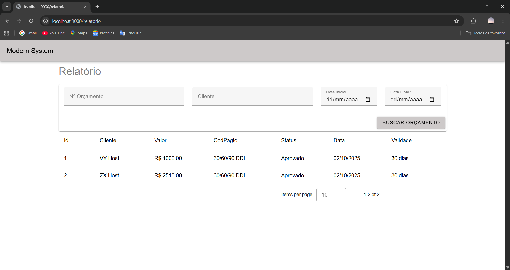
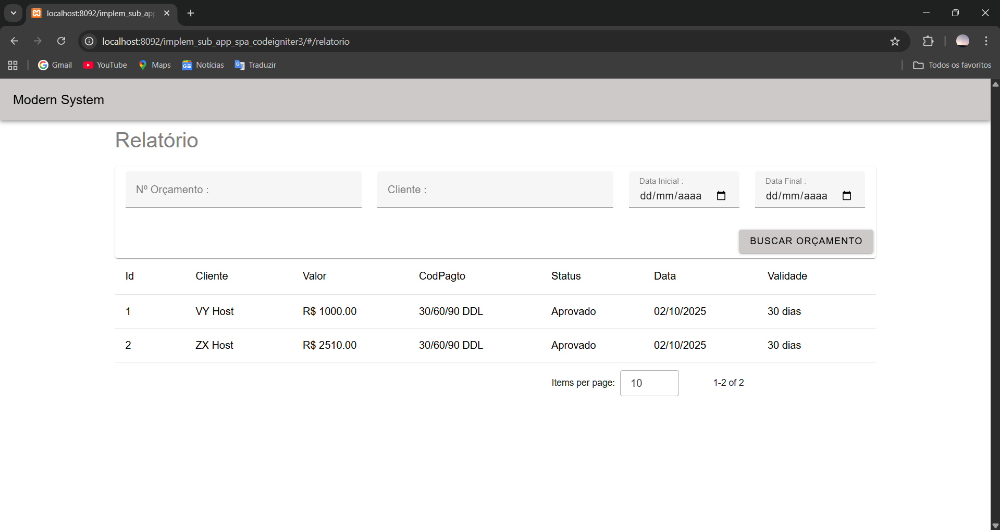
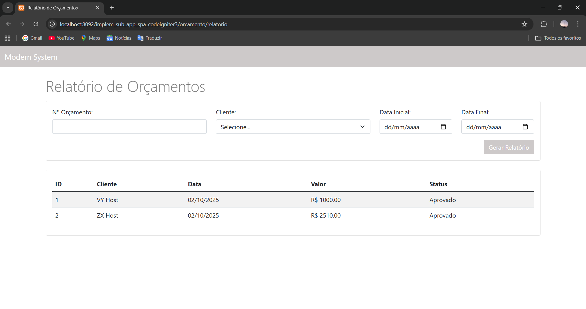

# Implementação de um sub-app SPA com Webpack + Vue.js + Vuetify/Bootstrap dentro do Codeingiter 3

Este projeto surgiu da necessidade de melhorar sistemas já existentes em CodeIgniter 3.

A ideia é não modificar a estrutura atual do sistema (que muitas vezes já está em estágio avançado de desenvolvimento), mas permitir que, à medida que novos módulos forem criados, pode-se se aproveitar os benefícios de um SPA (Single Page Application), agregando recursos modernos sem afetar as partes legadas/ já desenvolvidas.

Na implementação tradicional, as páginas eram renderizadas diretamente pelo CodeIgniter: ao chamar uma função do controller, era carregada uma view. Esse modelo funcionava, mas não proporcionava a experiência de uma SPA (Single Page Application), onde toda a aplicação roda a partir de um único p ionto de entrada.

# Problema Identificado

- Cada view era carregada de forma independente pelo servidor.

- A navegação não era fluida, pois sempre havia recarregamento de página.

- Dificultava a adoção de padrões modernos de desenvolvimento frontend.

# Solução Proposta

Criei uma integração entre CodeIgniter 3 e Vue.js 3, permitindo rodar o sistema em um modelo híbrido:

- Views antigas continuam funcionando da forma convencional, renderizadas pelo CodeIgniter.

- Novas páginas podem ser desenvolvidas dentro de um SPA com Vue.js, proporcionando:

- Melhor experiência para o cliente (navegação fluida, sem recarregamentos completos).

- Arquitetura moderna e mais escalável.

- Possibilidade de evolução gradual do sistema, sem necessidade de reescrever tudo de uma vez.

# Benefícios da implementação de um sub-app SPA com Webpack + Vue.js + Vuetify/Bootstrap

A adoção de um sub-app SPA dentro do sistema trouxe diversos ganhos técnicos e de usabilidade, entre eles:

🚀 Hot Reload – permite que as interfaces sejam atualizadas automaticamente durante o desenvolvimento, aumentando a produtividade.

📦 Build otimizado – geração de arquivos minificados, resultando em aplicações mais leves e rápidas.

⚡ Reatividade – experiência de usuário fluida, com interfaces dinâmicas.

🔄 Navegação sem recarregamento – eliminação de reloads completos da página.

🛠️ Produtividade – maior agilidade na criação e manutenção de novas funcionalidades.

🎨 Interfaces modernas – uso de Vuetify ou Bootstrap para design responsivo e atualizado.

🧩 Componentização – criação de interfaces modulares, reutilizáveis e bem estruturadas.

📚 Código organizado e moderno – melhoria na legibilidade e manutenção da base de código.

🌀 Gerenciamento de estado – uso de bibliotecas como Pinia/Vuex para oferecer melhor experiência de uso ao cliente.

🌐 Consumo de APIs simplificado – integração com Axios para realizar requisições HTTP de forma prática e padronizada.

📥 Facilidade de instalação de pacotes – utilização do npm/yarn para instalar, atualizar e gerenciar dependências do frontend.

🔗 Desacoplamento – arquitetura que facilita a migração futura para frameworks mais modernos (CodeIgniter 4 ou Laravel), já que o frontend funciona de forma independente do backend.

🟩 Carregamento de páginas - Permite carregamento de páginas componentizadas com ou ainda sem componentização com a extensão .vue, .js e .html

# Instalação para execução do SPA(Single Page Application) fora ou dentro do Framework Codeigniter

## Instalação

Abra a pasta resources. E instale as dependências

```sh

npm install

```

## Execução do sup-app fora do codeigniter

Dentro da pasta resources. Execute o seguinte comando :

```sh

    npm start

```

Um servidor webpack será iniciado, normalmente no endereço http://localhost:9000

## Execução do sup-app dentro do codeigniter

### Requisitos

- PHP 7.4.33 
- Servidor Xammp ou de sua preferência

### Alteração da base_url no arquivo config/config.php

Altere a base url que o projeto codeigniter será executado de acordo com seu ambiente.

```sh

$config['base_url'] = 'http://localhost:8092/implem_sub_app_spa_codeigniter3';

```

### Execução do sub-app

Dentro da pasta resources. Execute o seguinte comando :

```sh

    npm run build:dev


```

Automaticamente um build será gerado, para que o codeingiter possa ler este build e executar o sub-app dentro do codeigniter.

### Inicie o servidor Xammp ou de sua preferência

Abra o codeigniter na url base configurada. Neste caso este projeto está configurado para este endereço http://localhost:8092/implem_sub_app_spa_codeigniter3

# Imagem do sub-app rodando fora do codeigniter

[](assets/sub_app_sendo_executado_fora_do_codigniter.png)

# Imagem do sub-app sendo executado dentro do codeigniter

[](assets/sub_app_sendo_executado_dentro_do_codigniter.png)

# Imagem de view feita com bootstrap sendo executada dentro do codeigniter, mas fora do sub-app(SPA)

[](assets/sub_app_sendo_executado_dentro_do_codigniter_fora_do_sub_app.png)


